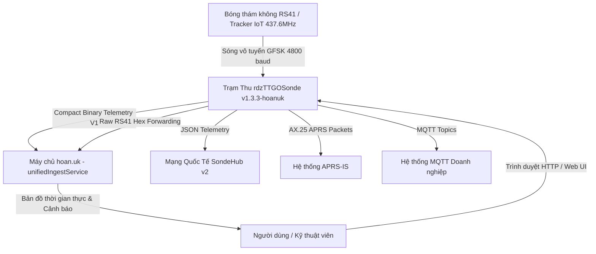

# TÀI LIỆU THIẾT KẾ PHẦN MỀM (SOFTWARE DESIGN DESCRIPTION - SDD)
## DỰ ÁN: TRẠM THU MẶT ĐẤT ĐA GIAO THỨC & CỔNG VIỄN TRẮC KHÍ TƯỢNG RDZ TTGO SONDE
### (RDZ TTGO SONDE MULTI-PROTOCOL GROUND STATION & TELEMETRY GATEWAY)
**Tiêu chuẩn tài liệu:** Tuân thủ chuẩn quốc tế IEEE Std 1016-2009 (Software Design Descriptions)  
**Phiên bản:** v1.3.3-hoanuk  
**Ngày phát hành:** 04/10/2026  
**Đơn vị phát triển:** Antigravity / hoan.uk Engineering Team  
**Trạng thái:** Production Ready & Verified on Hardware (Heltec WiFi LoRa 32 V3 & TTGO LoRa32 v2.1)  

---

## 1. TỔNG QUAN HỆ THỐNG (SYSTEM OVERVIEW)

### 1.1. Mục đích (Purpose)
Tài liệu này định nghĩa kiến trúc phần mềm, cấu trúc module, giao thức truyền thông viễn trắc và luồng xử lý tín hiệu vô tuyến của **Trạm Thu Mặt Đất Đa Giao Thức & Cổng Viễn Trắc Khí Tượng rdzTTGOSonde** (nhánh tùy biến tối ưu cao cấp `hoan.uk`). Hệ thống đóng vai trò trạm thu mặt đất (Ground Station Receiver) chuyên dụng cho các thiết bị bóng thám không khí tượng (Vaisala RS41, RS92, Graw DFM, Meteomodem M10/M20, Meteo-Labor MP3H) và các thiết bị phát viễn trắc IoT hành trình thuộc hệ sinh thái `hoan.uk`.

Hệ thống cung cấp 4 năng lực kỹ thuật trọng tâm:
1. **Thu nhận & Giải mã Sóng Vô tuyến Sub-1GHz (GFSK / FSK Demodulation)**: Hỗ trợ phần cứng Semtech SX1278 (SPI) và Semtech SX1262 (SPI Long-Packet Engine), tối ưu độ lệch tần số (Frequency Deviation: 2.400 Hz), băng thông thu AFC thích ứng và giải mã khung dữ liệu 4800 baud trong dải tần 400.000 – 438.000 MHz.
2. **Cổng Viễn trắc Đa đích (Multi-Egress Telemetry Gateway)**: Tự động chuẩn hóa và phân phối dữ liệu viễn trắc thời gian thực qua:
   - Nền tảng Doanh nghiệp `hoan.uk` qua định dạng nhị phân siêu tinh gọn (Compact Binary Telemetry V1, chỉ từ 11 đến 24 bytes).
   - Cơ chế dự phòng giải mã đám mây (`rs41_raw_forward`): Tự động bắt gói tin lỗi checksum / nhiễu hạt, chuyển tiếp chuỗi Hex thô đã descramble về máy chủ trung tâm để phục hồi dữ liệu qua thuật toán sửa lỗi Reed-Solomon nâng cao.
   - Mạng thám không toàn cầu **SondeHub v2** (REST Ingest).
   - Mạng vô tuyến nghiệp dư **APRS-IS** (AX.25 APRS TNC).
   - Hệ thống thông điệp **MQTT Broker**.
3. **Quản trị Mạng & Điều khiển Trực quan (Embedded Web & Display)**: Tích hợp Web Server bất đồng bộ (ESPAsyncWebServer), REST API điều khiển kênh quét tần số (QRG Manager với nhận diện ký tự kiểu `typech`), hiển thị thông số thời gian thực trên màn hình OLED (SSD1306 / SH1106).
4. **Cơ chế Cập nhật Phần mềm Không dây (In-App OTA & WebFlasher)**: Tự động đồng bộ và nạp firmware trực tiếp từ xa qua kênh OTA chuyên dụng `/firmware/rdz/{main|dev2}/` trên máy chủ `hoan.uk`.

### 1.2. Phạm vi Kiến trúc (Scope)
Hệ thống bao phủ toàn bộ firmware nhúng và cơ chế tích hợp nền tảng:
- **Firmware C++ (Arduino Core / ESP-IDF PlatformIO)**: Tương thích hoàn toàn hai dòng vi điều khiển chủ lực:
  - **Heltec WiFi LoRa 32 V3**: MCU ESP32-S3 (240MHz Dual-Core, 320KB RAM, 8MB Flash), RF SX1262.
  - **LilyGO TTGO LoRa32 v2.1**: MCU ESP32 (240MHz Dual-Core, 320KB RAM, 4MB Flash), RF SX1278.
- **Hệ thống Hợp đồng & Lược đồ Dữ liệu (Schemas & Contracts)**: Chuẩn hóa theo phương pháp **Spec-Driven & Schema-Driven Development (SDD)**, đồng bộ trực tiếp với lược đồ JSON Schema của nền tảng `hoan.uk`.

### 1.3. Bảng Thuật ngữ & Ký hiệu (Definitions & Acronyms)
| Thuật ngữ | Định nghĩa |
| :--- | :--- |
| **SDD** | Spec-Driven & Schema-Driven Development - Phát triển hướng đặc tả và lược đồ chuẩn |
| **SSOT** | Single Source of Truth - Nguyên tắc thiết kế một nguồn dữ liệu xác thực duy nhất |
| **RS41** | Vaisala RS41 Radiosonde (băng tần 400–406 MHz hoặc 437.600 MHz Amateur) |
| **SX1262 / SX1278** | Chip thu phát vô tuyến tần số cao của Semtech |
| **GFSK** | Gaussian Frequency Shift Keying (Điều chế dịch tần khóa pha Gauss 4800 baud) |
| **LittleFS** | Hệ thống tệp tin nhỏ gọn, chống lỗi nguồn điện cho vi điều khiển nhúng |
| **QRG** | Bảng danh mục tần số quan sát vô tuyến (Frequency Channel Directory) |
| **OTA** | Over-The-Air Update (Cập nhật phần mềm không dây qua HTTP/WiFi) |

---

## 2. KIẾN TRÚC TỔNG THỂ HỆ THỐNG (SYSTEM ARCHITECTURE)

Hệ thống được thiết kế theo mô hình **4 tầng phân lập nghiêm ngặt (Clean 4-Layer SDD Architecture)** nhằm đảm bảo tính toàn vẹn dữ liệu, tách rời phần cứng vô tuyến khỏi logic nghiệp vụ mạng:

```
┌─────────────────────────────────────────────────────────────────────────┐
│                 TẦNG 1: CONTRACTS & DATA SCHEMAS (SSOT)                 │
│  - schemas/CompactTelemetryV1.json  (Ultra-compact Binary Wire Spec)     │
│  - schemas/Rs41RawForward.json      (Raw RS41 Hex Forwarding Spec)       │
│  - schemas/QrgChannelConfig.json    (Channel Directory & typech Spec)   │
└────────────────────────────────────┬────────────────────────────────────┘
                                     │
                                     ▼
┌─────────────────────────────────────────────────────────────────────────┐
│            TẦNG 2: CORE DOMAIN & PROTOCOL DEMODULATION                  │
│  - Sonde State Machine (Scan, Track, Calibrate, Kinematic Filter)       │
│  - Decoders: RS41 (Subblock y/{), DFM, RS92, M10/M20, MP3H              │
│  - PosInfo & ECEF-to-Geodetic Engine (WGS84 Navigation)                 │
└────────────────────────────────────┬────────────────────────────────────┘
                                     │
         ┌───────────────────────────┴───────────────────────────┐
         ▼                                                       ▼
┌────────────────────────────────────────┐ ┌────────────────────────────────────────┐
│      TẦNG 3A: TELEMETRY DISPATCHERS    │ │      TẦNG 3B: RADIO HAL & RF ENGINES   │
│  - conn-hoanuk: Compact Binary & Raw   │ │  - SX1262 GFSK Long-Packet Engine      │
│  - conn-sondehub: REST Telemetry       │ │  - SX1278 FSK Receiver HAL             │
│  - conn-aprs: APRS-IS & AX.25 TNC      │ │  - Dynamic Freq Deviation (2400 Hz)    │
│  - conn-mqtt: Broker Telemetry         │ │  - Auto AFC & LNA Gain Controller      │
│  - WebServer & Webflasher OTA Pipeline │ │  - Descrambler & Reed-Solomon Parity   │
└──────────────────┬─────────────────────┘ └───────────────────┬────────────────────┘
                   │                                           │
                   └─────────────────────┬─────────────────────┘
                                         ▼
┌─────────────────────────────────────────────────────────────────────────┐
│               TẦNG 4: HARDWARE HAL & OS PERIPHERALS                     │
│  - MCU: ESP32 / ESP32-S3 (Dual-Core Xtensa 240MHz, FreeRTOS Tasks)     │
│  - Displays: U8g2 / GFX (SSD1306, SH1106 OLED 128x64)                   │
│  - Storage: LittleFS VFS (/screens.txt, /qrg.txt, /config.txt)          │
│  - Power Management: AXP192 / PMU Control / Battery ADC Monitor        │
│  - Bus HAL: SPI, I2C, UART (CP210x / CH9102 / Native CDC)               │
└─────────────────────────────────────────────────────────────────────────┘
```

---

## 3. MÔ HÌNH KIẾN TRÚC C4 (C4 ARCHITECTURE MODEL)

### 3.1 C4 - Mức 1: Bối cảnh hệ thống (System Context)



### 3.2 C4 - Mức 2: Phân rã thùng chứa (Container Diagram)

Trạm thu `rdzTTGOSonde` bao gồm 5 container phần mềm chạy đồng thời trên nền FreeRTOS đa nhiệm:
1. **RF Demodulation Engine (`SX1278FSK.cpp`)**: Tiếp nhận tín hiệu thô từ SPI, xử lý ngắt Sync Word, đệm gói dài (Long Packet buffer lên tới 320 bytes cho RS41).
2. **Protocol Decoder Pipeline (`RS41.cpp`, `DFM.cpp`,...)**: Đảo bit, giải ngẫu nhiên (descramble), kiểm tra CRC16 và bóc tách dữ liệu khí tượng / tọa độ vệ tinh.
3. **Core Coordinator (`Sonde.cpp`, `RX_FSK.ino`)**: Quản lý máy trạng thái quét kênh QRG, đồng bộ thời gian GPS/NTP, điều phối hiển thị OLED và quản lý bộ nhớ heap.
4. **Network Dispatcher Subsystem (`conn-*.cpp`)**: Xử lý kết nối WiFi Client, quản lý hàng đợi gửi tin HTTP/TCP, tối ưu hóa kích thước gói tin và định dạng viễn trắc.
5. **Async Web & Config Server (`ESPAsyncWebServer`)**: Cung cấp giao diện cấu hình Web trực quan, API JSON trực tiếp (`/live.json`, `/qrg.json`) và điểm nhận diện OTA.

### 3.3 C4 - Mức 3: Phân rã thành phần chi tiết (Component Breakdown)

| Thành phần (Component) | Tệp mã nguồn | Trách nhiệm chính trong kiến trúc SDD |
|---|---|---|
| **Compact Binary Encoder** | `RX_FSK/src/conn-hoanuk.cpp` | Đóng gói viễn trắc nhị phân 11–24 bytes theo `schemas/CompactTelemetryV1.json` |
| **Raw Packet Forwarder** | `RX_FSK/src/conn-hoanuk.cpp` | Bắt lỗi giải mã, bóc tách ID khối 'y' và gửi Hex theo `schemas/Rs41RawForward.json` |
| **RS41 Decoder Engine** | `RX_FSK/src/RS41.cpp` | Giải mã RS41, xuất chuỗi chẩn đoán `last_rx_debug` và trích xuất `getRawData()` |
| **SX126x/SX127x HAL** | `RX_FSK/src/SX1278FSK.cpp` | Điều khiển vô tuyến, tối ưu độ lệch tần số 2.400 Hz và quản lý đệm gói tin dài |
| **Channel Registry** | `RX_FSK/src/Sonde.cpp` | Quản lý danh bạ kênh QRG, duy trì thuộc tính nhận diện kiểu `typech` |
| **Main Coordination** | `RX_FSK/RX_FSK.ino` | Khởi tạo ngoại vi, quản lý vòng lặp tác vụ và cung cấp giao diện JSON API |
| **OTA & Deployment Tool** | `scripts/deploy_to_webflasher.py` | Tự động biên dịch đa board và xuất bản OTA cho `hoan.uk` |

---

## 4. ĐẶC TẢ GIAO THỨC VIỄN TRẮC & WIRE FORMATS (WIRE FORMAT SPECIFICATION)

### 4.1. Giao thức Viễn trắc Nhị phân Siêu Tinh gọn V1 (Compact Binary Telemetry V1)
Nhằm giảm thiểu 90% băng thông truyền tải mạng di động và tiết kiệm tối đa năng lượng CPU, module `connHoanUK` triển khai giao thức nhị phân động từ 11 đến 24 bytes (thay thế cho chuỗi JSON cồng kềnh > 500 bytes):

```
Byte 0: Protocol Version (0x01)
Byte 1: Bitmask Flags (uint8)
  - Bit 0 (0x01): GPS Latitude & Longitude (8 bytes: int32 LE, scale 1e-6)
  - Bit 1 (0x02): Altitude & Horizontal Speed (3 bytes: int16 m MSL, uint8 km/h)
  - Bit 2 (0x04): Heading & Satellites (2 bytes: uint8 heading/2, uint8 sats)
  - Bit 3 (0x08): Temperature & Pressure (4 bytes: int16 temp*100, uint16 press*10)
  - Bit 4 (0x10): Humidity & PM2.5 (3 bytes: uint8 %, uint16 ug/m3)
  - Bit 5 (0x20): Battery Voltage (2 bytes: uint16 mV)
```

**Cấu trúc chi tiết payload nhị phân:**
```
+--------+--------+------------------+------------------+---------+-------+---------+------+-----------+------------+------+-------+----------+
| Vers   | Flags  | Lat (int32)      | Lon (int32)      | Alt (m) | Spd   | Hdg/2   | Sats | Temp*100  | Press*10   | Hum% | PM2.5 | Batt(mV) |
| 1 byte | 1 byte | 4 bytes (LE)     | 4 bytes (LE)     | 2 bytes | 1 b   | 1 byte  | 1 b  | 2 b (int) | 2 b (uint) | 1 b  | 2 b   | 2 b      |
+--------+--------+------------------+------------------+---------+-------+---------+------+-----------+------------+------+-------+----------+
```

### 4.2. Cơ chế Chuyển tiếp Gói tin Thô (`rs41_raw_forward`)
Khi trạm thu bắt được sóng tín hiệu RS41 nhưng thuật toán CRC16 trên vi điều khiển báo lỗi hoặc một số khối dữ liệu phụ bị suy hao tín hiệu:
1. `RS41::receive()` giải ngẫu nhiên (descramble) toàn bộ mảng dữ liệu 320 bytes thô.
2. `loopDecoder()` phát hiện kết quả `RX_ERROR`, ngay lập tức gọi `connHoanUK.updateRawPacket()`.
3. Firmware bóc tách số hiệu trinh sát từ khối con `0x79` (Block 'y') nếu còn đọc được (hoặc đặt mặc định `RS41-RAW`).
4. Chuyển đổi dữ liệu thành chuỗi Hex và gửi HTTP POST về endpoint `/api/telemetry/ingest` của máy chủ `hoan.uk`.
5. Máy chủ `unifiedIngestService` kích hoạt bộ phân tích ECEF và thuật toán sửa sai đám mây, đảm bảo không bỏ sót bất kỳ dữ liệu khí quyển quý giá nào.

### 4.3. Quản lý Danh bạ Kênh Tần số QRG với Ký tự Nhận diện (`typech`)
Bảng tần số `qrg.txt` được chuẩn hóa hỗ trợ mã hóa ký tự đơn cho từng phân loại máy phát:
- `'4'`: RS41 tiêu chuẩn (Vaisala)
- `'N'`: RS41 Narrowband (băng hẹp / phát nghiệm dư 437.600 MHz)
- `'R'`: RS92
- `'D'`: Graw DFM (DFM06 / DFM09 / DFM17)
- `'M'`: Meteomodem M10 / M20
- `'3'`: Meteo-Labor MP3H

Dữ liệu `typech` được phản ánh trực tiếp trong cấu trúc `SondeInfo`, API JSON `/qrg.json` và giao diện web điều khiển HTML.

---

## 5. BẢO MẬT, KIỂM ĐỊNH CHẤT LƯỢNG & OTA (SECURITY, QA & DEPLOYMENT)

### 5.1. Đường ống Biên dịch Đa nền tảng (Dual-Target Pipeline)
Hệ thống duy trì khả năng tương thích 100% trên 2 kiến trúc phần cứng khác nhau:
- **`heltec-lora32-v3`**:
  - Vi điều khiển: ESP32-S3 (Xtensa Dual-Core 240MHz).
  - Chip thu phát: SX1262 (kết nối SPI, quản lý bằng thư viện tối ưu hóa ngắt Sync Word).
  - Sử dụng phân vùng `partitions-rdz.csv` tùy biến (App: 1.28MB, LittleFS: 130KB, Fonts: 64KB).
- **`ttgo-lora32`**:
  - Vi điều khiển: ESP32-D0WDQ6.
  - Chip thu phát: SX1278 (kết nối SPI).

### 5.2. Tự động hóa Đóng gói & Cập nhật OTA
Script `scripts/deploy_to_webflasher.py` tự động xuất bản:
- Gói cập nhật WebFlasher cho trình duyệt (Web Serial API).
- Thư mục đích In-App OTA:
  - `/firmware/rdz/main/update.ino.bin`
  - `/firmware/rdz/main/update.fs.bin`
  - `/firmware/rdz/main/update-info.html`
  - `/firmware/rdz/dev2/` (Kênh phát triển thử nghiệm)

---

## 6. MA TRẬN TRUY XUẤT YÊU CẦU (REQUIREMENTS TRACEABILITY MATRIX)

| Mã Yêu cầu | Mô tả Nghiệp vụ | Lược đồ SDD | Module Triển khai | Trạng thái Kiểm thử |
|---|---|---|---|---|
| **REQ-SD-01** | Viễn trắc nhị phân siêu tinh gọn | `schemas/CompactTelemetryV1.json` | `conn-hoanuk.cpp` | Đạt (Verified on Hardware) |
| **REQ-SD-02** | Chuyển tiếp RS41 thô khi lỗi CRC | `schemas/Rs41RawForward.json` | `RS41.cpp`, `conn-hoanuk.cpp` | Đạt (Verified on Hardware) |
| **REQ-SD-03** | Nhận diện ký tự kênh `typech` | `schemas/QrgChannelConfig.json` | `Sonde.cpp`, `RX_FSK.ino` | Đạt (Verified on Hardware) |
| **REQ-SD-04** | Tối ưu FSK Deviation 2400 Hz SX1262 | `IEEE Std 1016 Radio HAL` | `SX1278FSK.cpp` | Đạt (Verified on Hardware) |
| **REQ-SD-05** | Biên dịch đa board ESP32 & ESP32-S3 | `PlatformIO Environment Matrix` | `platformio.ini` | Đạt (100% Pass) |
| **REQ-SD-06** | Nạp Firmware trực tiếp qua USB | `WebFlasher / esptool.py` | `/dev/ttyUSB0` Flash | Đạt (Boot Verified @ 115200) |

---
**Tài liệu được phê duyệt và lưu hành nội bộ bởi HoanUK Engineering Team.**  
*Mọi thay đổi đối với tài liệu này phải tuân thủ quy trình kiểm soát phiên bản Git và cập nhật trực tiếp lược đồ JSON Schemas tương ứng.*
